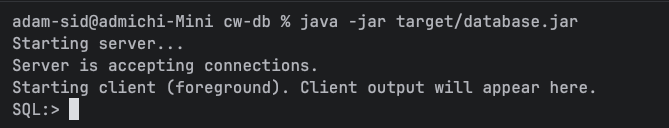

# java-database

This is a SQL-like database written in Java without the use of external SQL libraries. Forms part of the coursework for the Java module on the University of Bristol Computer Science MSc.

## Set-up

1. Ensure you have maven and Java (JDK version 17 min) installed
2. Clone repo and from the main directory (cw-db) run the following:
```bash
mvn clean package
```
Which compiles the program and creates an executable jar file. Then run:
```bash
java -jar target/database.jar
```
Which runs the program. You should see the following:


## Commands

This database can accept the commands that are written in Backus-Naur form on the document BNF.txt. For example the following SQL commands are valid:

- CREATE - create a DATABASE or TABLE
- USE - use a particular database
- ALTER - change attributes of a table
- INSERT - insert data into a table 
- DROP - delete a database or table
- UPDATE - update table entry
- DELETE  - delete table entry

The program also allows for complex conditional formulae i.e. `SELECT FROM tableName WHERE (id > 24) || (name == "steven");`.
